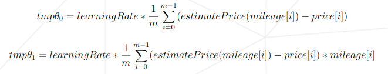
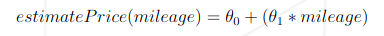
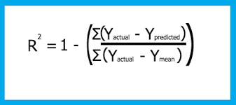

# Linear Regression


## Objective

The aim of this project is to introduce us to the basic concept behind `machine learning`.
For this project, we will have to create a program that predicts the **price of a car** based on its **mileage** by using a linear function train with a gradient descent algorithm.

The project focuses on understanding core machine learning concepts by building a model from scratch, including:
- The linear regression formula
- Gradient descent optimization
- Manual CSV file handling
- Data validation and error handling

This project let us choose the language of our choice.
I choose python because it allow us to easily visualize our data, it will be helpfull for debugging.

## Programs

1. Train

Here we read our dataset file and perform a linear regression on the data.
I used the following formulas to calculate theta0 and theta1 that I will need for the predict program :



2. Predict

This program will be used to predict the price of a car for a given mileage.
In order to give us back the estimate price for that mileage, I used the following formula :



## Project Structure

| File          | Description                                                   |
|---------------|---------------------------------------------------------------|
| `train.py`    | Trains the model using gradient descent on `data.csv`         |
| `predict.py`  | Predicts car prices based on mileage using `theta.csv`        |
| `values.csv`  | Stores the learned values for                                 |
| `data.csv`    | Training data file with two columns: `km` and `price`         |
| `README.md`   | Project documentation   


## Precision Formula

I also added a program that calculates the precision of my algorithm, I used this following formula :



## Usage

Training phase
```bash
python3 train.py -d data.csv
```

Predict phase
```bash
python3 predict.py -f values.csv
```
